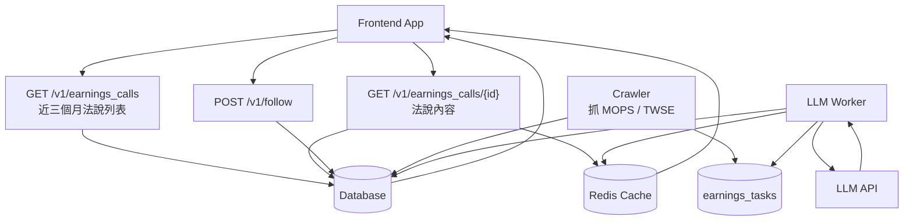
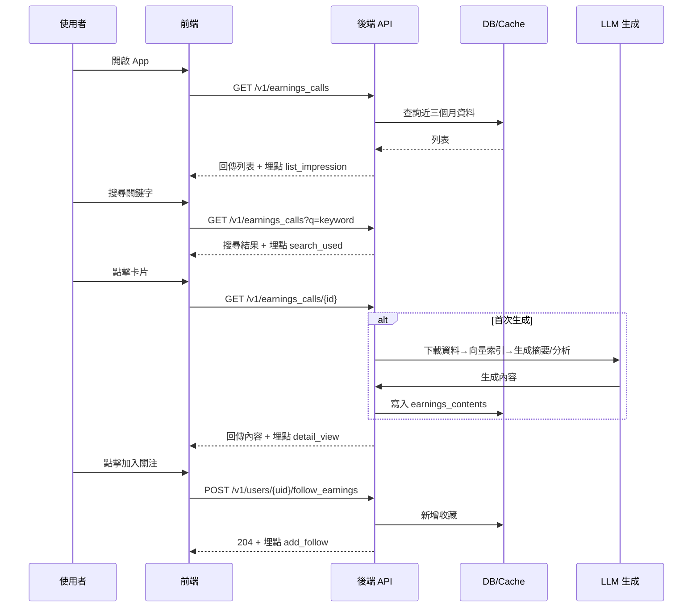

# AI-earnings

AI讀法說專案：提供近三個月台股法說會列表、AI 生成摘要與分析、收藏與回訪體驗。

## 靜態前端（GitHub Pages 用）
- 路徑：`ai-earning-demo/index.html`
- 特色：內建搜尋、日期分組列表、收藏/取消收藏（localStorage）、空態提示、內頁摘要/AI 分析/資料來源與 Archived 標記。
- 部署：直接推送此資料夾至 GitHub Pages（主/gh-pages branch 均可），不需建置流程。

## 使用方式
1. 參考 `docs/PRD.md` 理解產品需求與假設。
2. 依 `docs/API_DESIGN.md` 的端點規格實作後端服務。
3. 前端：
   - Screen 01（法說會列表）呼叫 `GET /v1/earnings_calls`，支援搜尋與排序。
   - Screen 02（法說會內頁）呼叫 `GET /v1/earnings_calls/{call_id}`；收藏操作呼叫 `POST/DELETE /v1/users/{uid}/follow_earnings`。
   - Screen 03（我關注的法說）呼叫 `GET /v1/users/{uid}/follow_earnings`，支援載入更多。
4. 排程：每日 02:00 UTC+8 執行爬蟲更新法說會清單。

## 檔案說明
- `docs/PRD.md`：產品需求、目標、範圍與里程碑。
- `docs/API_DESIGN.md`：API 端點與資料模型設計。
- `README.md`：使用方式、資料與架構說明（本檔）。

## 資料庫設計
- **earnings_calls**：`id`, `src_id`, `stock_code`, `stock_name`, `call_date`, `raw_html`, `is_archived`, `created_at`；熱資料保留 90 天，舊資料搬冷層。
- **earnings_contents**：`id`, `call_id`, `summary`, `analysis`, `sources (jsonb)`, `vector_index_uri`, `version`, `generated_at`, `created_at`；內容生成後靜態保存。
- **user_follow_earnings**：`id`, `user_id`, `call_id`, `created_at`；多對多關係，禁止 ON DELETE CASCADE。
- 索引：`earnings_calls(call_date, stock_code)`、`earnings_calls(stock_name, stock_code) GIN/LIKE` 以優化搜尋；`user_follow_earnings(user_id, created_at desc)`。

## ER 流程
- `earnings_calls 1 - 1 earnings_contents`（每場法說會對應唯一摘要/分析版本）。
- `users n - n earnings_calls` 經由 `user_follow_earnings` 建立收藏關係。
- 歸檔：`earnings_calls.is_archived=1`（>18 個月）；仍可被收藏與查詢。

## API 設計
完整規格參見 `docs/API_DESIGN.md`，重點端點：
- `GET /v1/earnings_calls`：近三個月列表、搜尋、排序、分頁。
- `GET /v1/earnings_calls/{call_id}`：內頁摘要、分析、資料來源。
- `POST /v1/users/{uid}/follow_earnings` / `DELETE /v1/users/{uid}/follow_earnings`：收藏/取消收藏。
- `GET /v1/users/{uid}/follow_earnings`：收藏清單，預設近 6 個月，可載入更多。

## 系統架構圖（Workflow＆註解）

## User Journey（端到端行為路徑）
1. 開啟 App → 看見「法說會列表」預設按日期排序。
2. 使用搜尋找特定代號/名稱；若無結果顯示空態。
3. 點擊卡片進入內頁，閱讀摘要、分析、資料來源。
4. 點擊「加入關注」收藏；或在「我關注的法說」列表回訪並可取消收藏。
5. 歸檔內容仍可查看；熱門法說由快取提升讀取速度。

## 功能 User Story
- 作為投資人，我希望能在 300 ms 內搜尋近三個月法說會名單，快速鎖定研究標的。
- 作為投資人，我希望內頁摘要 200–300 字、分析 ≤500 字且固定不跳動，以便迅速理解重點。
- 作為投資人，我希望能收藏/取消收藏並在 0.3 秒內得到回饋，方便維護追蹤清單。
- 作為投資人，我希望能在收藏列表載入更多過往法說，方便回顧歷史。

## FlowChart（主要互動流程）

## 功能描述彙整（用戶端 & 系統端）
- **法說會列表**
  - 用戶端：顯示近三個月卡片、搜尋、排序、空態、捲動追蹤。
  - 系統端：每日爬蟲寫入 `earnings_calls`；列表 API 支援模糊搜尋與分頁；回傳後紀錄 list_impression、scroll_depth、search_used。
- **法說會內頁**
  - 用戶端：顯示名稱/代號/日期、摘要、AI 分析、資料來源；收藏/取消收藏按鈕，返回列表。
  - 系統端：首次點擊或新資料觸發 PDF+新聞擷取、向量索引、LLM 生成；內容快取 30 分鐘，熱門進 Redis；生成失敗提示重試；埋點 detail_view、source_click、add/remove_follow、archived_view。
- **我關注的法說**
  - 用戶端：展示收藏卡片（預設 6 個月）、載入更多、可取消收藏。
  - 系統端：JOIN 冷/熱層回傳收藏列表；App 啟動時執行增量同步；埋點 follow_list_view、follow_card_click、unfollow_swipe。

